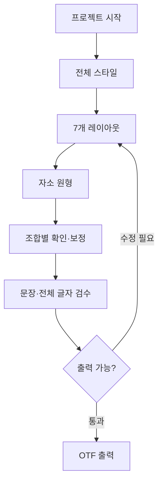

# 한글 폰트 메이커 UX·화면 명세

> 상태: `draft for UX review`
> 작성일: 2026-08-23
> 관련 문서: `COMMON_GRID_HYBRID_IMPLEMENTATION_PLAN.md`
> 기준: 모바일에서 전체 제작 가능, 데스크톱·태블릿에서는 정밀 편집 효율 강화

## 0. 문서 목적

이 문서는 사용자가 기술 구조를 먼저 이해하지 않아도 아래 흐름으로 하나의 한글 폰트를 완성하도록 화면과 인터랙션을 정의한다.

```text
프로젝트 시작
→ 전체 스타일 설정
→ 7개 조합 레이아웃 정리
→ 역할별 자소 원형 제작
→ 조합별 자동 결과 확인·예외 보정
→ 문장과 전체 글자 검수
→ 테스트 또는 완성 OTF 출력
```

구현 플랜의 `jamo role master`, `context preset`, `context variant`, `core rail` 같은 기술 용어는 저장·해석 계층에서 유지한다. 일반 사용자 화면에서는 작업 목적이 드러나는 표현으로 번역한다.

## 1. UX 핵심 결정

### 1.1 사용자는 기본값에서 시작하고 예외만 수정한다

- 새 프로젝트를 만들면 역할별 기준 그리드, 7개 기본 조합, 문맥 프리셋을 자동 생성한다.
- 사용자는 모든 조합을 처음부터 각각 그리지 않는다.
- 자소 원형 하나를 만들면 시스템이 조합별 결과를 자동 생성한다.
- 사용자는 7개 결과를 비교하고 어색한 문맥만 보정한다.
- 공통 문제가 보이면 상위의 `조합 기본값`으로 올리고, 한 자소만의 문제라면 `이 조합만 보정`한다.

### 1.2 모바일에서도 완주할 수 있지만 정밀 작업은 전용 화면으로 분리한다

- 모바일에서도 레이아웃 편집, 자소 선·면 제작, 레일 추가, 문맥 보정, 검수, 출력이 가능해야 한다.
- 한 화면에 문장·7개 비교·그리드·정밀 조절·속성 패널을 모두 쌓지 않는다.
- 레이아웃 편집, 자소 원형 편집, 조합별 보정, 문장 검수는 각각 독립된 주 화면으로 분리한다.
- 데스크톱은 같은 정보구조를 유지하되 캔버스·미리보기·속성 패널을 동시에 보여준다.

### 1.3 기존 트랙패드는 `정밀 조절`로 재정의한다

화면에서 `트랙패드`라는 범용 명칭 대신 `정밀 조절` 또는 조절 대상 이름을 사용한다. 역할은 선택한 값을 연속적으로 미세 조절하는 보조 입력이다.

```text
캔버스 직접 조작 = 무엇을 바꿀지 선택하고 구조를 편집
정밀 조절 패드 = 선택한 값을 연속적으로 미세 조절
속성 패널 = 정확한 수치·수정 범위·값의 출처 관리
```

정밀 조절 패드가 적합한 작업:

- 레일 위치와 슬롯 비율
- 선택한 점의 X/Y 위치
- 여백·중심·비례
- 곡률 tension
- slant와 중심선 굵기
- 선택 요소의 offset

직접 캔버스 조작이 필요한 작업:

- 레일·획·셀·모서리 선택
- 레일 추가·삭제
- 셀 채우기·비우기
- 곡률·사선 종류 지정
- 앵커·셀 경계의 참조 재연결
- 선·면 채널과 레이어 선택

정밀 조절 패드에서 삭제·재연결·범위 승격 같은 구조적 또는 파급력이 큰 작업을 실행하지 않는다. 레일의 위치를 움직이는 것과 앵커를 다른 레일에 다시 연결하는 것은 반드시 서로 다른 명령이어야 한다.

### 1.4 수정 범위를 항상 먼저 보여준다

모든 편집 화면 상단에는 `수정 범위 바`를 고정한다.

예시:

```text
초성 ㄱ 원형 · 모든 조합에 반영
ㄱ · 가로모음+받침 조합만 보정
모든 초성 · 가로모음+받침 기본값
7개 레이아웃 · 공통 기준선
```

- 기본값은 가장 좁고 안전한 범위다.
- 더 넓은 범위로 올릴 때는 영향받는 자소·조합 수를 먼저 보여준다.
- 값의 출처를 `원형`, `조합 기본값`, `이 글자에서 수정` 상태로 표시한다.
- 색만으로 구분하지 않고 아이콘과 텍스트를 함께 사용한다.

### 1.5 선형 온보딩과 자유 이동을 함께 제공한다

- 첫 프로젝트에서는 다음 할 일을 알려주는 단계형 흐름을 제공한다.
- 한 번 설정을 마친 뒤에는 사용자가 원하는 화면으로 자유롭게 이동한다.
- 출력 전 검증 외에는 화면 이동을 강제로 막지 않는다.
- 진행률은 추상적인 퍼센트보다 `초성 원형 12/19`, `확인하지 않은 조합 8개`처럼 실제 작업 단위로 보여준다.

## 2. 사용자용 용어

| 사용자 화면 표현 | 내부 개념 | 화면에서의 설명 |
|---|---|---|
| 자소 원형 | `jamo role master` | 여러 조합으로 파생되는 역할별 기본 모양 |
| 역할 | `STANDALONE/CH/JU/JO...` | 단독 자음·초성·모음·받침에서 맡는 자리 |
| 조합 | `layout context` | 세로모음·가로모음·혼합모음과 받침 유무 |
| 조합 기본값 | `context preset` | 같은 역할의 여러 자소에 공통 적용되는 조합 규칙 |
| 이 조합만 보정 | `jamo context variant` | 특정 자소의 특정 조합에만 저장되는 예외 |
| 기준선 | `core rail` | 모든 자소가 공통으로 보장하는 기본 레일 |
| 보조선 | `auxiliary rail` | 특정 형태나 획에만 추가하는 레일 |
| 이 기준선에 연결 | `reference rebinding` | 선택한 획·점·셀 경계가 참조할 레일 변경 |
| 자동 결과 | derived context/result | 원형과 조합 규칙으로 계산된 저장하지 않는 결과 |
| 최종 윤곽 | `InkRegion` union | 화면과 OTF에서 함께 사용하는 실제 잉크 형태 |

고급 설정과 개발자 정보에서만 내부 용어를 병기한다.

## 3. 전체 사용자 여정



### 추천 작업 순서

1. 새 프로젝트와 시작 프리셋을 선택한다.
2. 전체 굵기·기울기·Design Body·끝처리의 기본 인상을 잡는다.
3. `ㄱ·가·고·과·각·곡·곽`으로 7개 공통 레이아웃을 조정한다.
4. 대표 자소 `ㄱ·ㅇ·ㅏ·ㅂ·ㅎ·ㅙ`으로 선·면·곡률 체계를 검증한다.
5. 자소 목록에서 나머지 역할별 원형을 제작한다.
6. 각 원형에서 자동 생성된 조합을 검토하고 필요한 것만 보정한다.
7. 예시 문장과 직접 입력한 문장에서 충돌·균형·속공간을 검수한다.
8. 테스트 OTF를 반복 출력한 뒤 전체 조건을 통과하면 완성 OTF를 출력한다.

## 4. 정보구조와 반응형 셸

### 4.1 주 내비게이션

프로젝트 안에서는 홈과 네 개의 작업 영역을 주 내비게이션에 노출한다.

| 메뉴 | 포함 화면 |
|---|---|
| 홈 | 진행 현황, 추천 다음 작업, 최근 변경, 문제 요약 |
| 뼈대 | 전체 스타일, 공통 레이아웃, 조합 기본값 |
| 자소 | 자소 현황, 역할별 원형, 조합별 결과 |
| 검수 | 예시 문장, 직접 입력, 레이아웃 매트릭스, 문제 목록 |
| 출력 | 테스트 OTF, 완성 OTF, 프로젝트 저장·내보내기 |

- 모바일: 하단 5탭. `홈`은 초보자의 다음 작업 안내와 자유 이동의 기준점이다.
- 데스크톱: 왼쪽 세로 내비게이션.
- 전체 프로젝트 목록 P-01은 프로젝트 이름 메뉴의 `프로젝트 나가기`로 이동한다.

### 4.2 모바일 공통 셸

위에서 아래 순서:

1. 프로젝트 헤더: 프로젝트 이름, 저장 상태, Undo/Redo, 더보기.
2. 화면 제목과 수정 범위 바.
3. 큰 작업 캔버스 또는 대표 미리보기.
4. 필요할 때만 보이는 가로 스크롤 비교 스트립.
5. 현재 도구를 위한 하단 액션 바.
6. 정밀 조절·속성·사용처는 하나의 하단 드로어에서 교체한다.
7. 주 내비게이션.

규칙:

- 390px에서 페이지 전체 가로 overflow가 없어야 한다.
- 가로 스크롤은 비교 스트립 안에서만 허용한다.
- 캔버스가 있는 화면에서 중첩된 bottom sheet를 열지 않는다.
- 하단 드로어가 열려도 선택한 글자와 결과 윤곽 일부가 보여야 한다.
- 하단 드로어는 `접힘: 대상·값`, `중간: 정밀 조절`, `확장: 수치·출처·수정 범위`의 세 높이를 사용한다.
- 모든 터치 대상은 최소 44×44px을 확보한다.

### 4.3 데스크톱·태블릿 셸

- 왼쪽: 작업 영역 내비게이션과 자소·문제 목록.
- 가운데: 주 캔버스.
- 오른쪽: 선택 속성, 수정 범위, 정밀 조절 또는 숫자 입력.
- 아래: 7개 비교 또는 문장 미리보기 스트립.
- 데스크톱은 직접 드래그·방향키·숫자 입력을 우선하고 정밀 조절 패드는 보조 scrubber로 유지한다.
- 태블릿에서 펜 입력은 직접 편집, 손가락은 pan/zoom으로 분리할 수 있지만 펜이 없어도 모바일과 같은 흐름을 제공한다.
- 하드웨어 트랙패드의 스크롤은 캔버스 pan/zoom에 사용하며 선택값 변경에 암묵적으로 연결하지 않는다.
- 모바일의 별도 화면은 데스크톱에서 패널로 동시에 열 수 있지만 저장 계약과 액션 이름은 동일하게 유지한다.

### 4.4 현재 모바일 중심 구조에 대한 수정 제안

- `MobileEditorV2Page`는 모든 편집을 직접 품는 페이지가 아니라 프로젝트 내부 반응형 셸과 진입 대시보드 역할로 축소한다.
- `CalibrationSentenceEditor`에 레이아웃·자소 제작 도구를 계속 추가하지 않고 `검수` 전용 화면으로 명확히 분리한다.
- `GlobalStyleTrackpad`는 전체 스타일 전용 컴포넌트가 아니라 선택 대상에 따라 모드가 바뀌는 공통 `PrecisionControlDrawer`로 승격한다. 사용자에게는 `정밀 조절`로 표시한다.
- `SharedLayoutGridBoard`는 공통 레이아웃 전용 주 화면으로 둔다.
- `ConstructionGridEditor`는 자소 원형과 조합별 보정에서 공유하는 정밀 편집 캔버스로 둔다.
- `MobileSharedGridSheet`는 레일 사용처뿐 아니라 수정 범위·영향 확인을 담당하는 공통 시트로 확장한다.
- 모바일에서는 `자소 원형 편집`과 `조합별 보정`을 별도 화면으로 두어 사용자가 현재 수정 범위를 혼동하지 않게 한다.

## 5. 공통 인터랙션 계약

### 5.1 수정 범위 바

구성:

- 현재 대상: `ㄱ`, `초성`, `가로모음+받침` 등.
- 범위: `원형`, `조합 기본값`, `이 조합만`.
- 영향 표시: `초성 19개에 반영`, `이 결과 1개만 변경`.
- 출처 표시: `자소 원형에서 가져옴`, `역할 기본값에서 가져옴`, `조합 기본값에서 가져옴`, `이 자소에서 수정됨`.
- `범위 변경` 액션.

범위 확대 시 영향 확인 시트를 먼저 띄운다. 범위 축소는 즉시 허용한다.

사용자가 선택할 수 있는 수정 범위는 세 가지 행동으로 고정한다.

- `이 자소의 원형 수정`.
- `현재 자소·현재 조합만 수정`.
- `현재 역할·조합의 전체 기본값 수정`.

`적용 범위`처럼 추상적인 단어만 쓰지 않고 `이 ㄱ만 조정`, `가로모음+받침의 모든 초성 조정`처럼 실제 행동을 함께 표시한다.

- 비교 스트립에서 카드를 탭하는 것은 관찰할 문맥만 바꾼다. 수정 범위를 암묵적으로 바꾸거나 variant를 만들지 않는다.
- 레이아웃 그리드와 자소 형태 그리드를 동시에 활성 편집 상태로 두지 않는다. 현재 화면의 그리드만 강조하고 다른 시스템은 잠긴 회색 오버레이로 표시한다.

### 5.2 정밀 조정 드로어와 조절 패드

조절 패드는 선택한 대상에 맞춰 형태가 바뀐다. 1축 값에 2축 패드를 사용하지 않으며 한 패드가 동시에 다루는 값은 최대 두 개다.

| 선택 대상 | 기본 컨트롤 |
|---|---|
| X 또는 Y 레일 하나 | 해당 축만 보이는 1축 조절 패드 |
| 교점·앵커·offset | X/Y 2축 조절 패드 |
| 슬롯 비율 | 너비/높이 2축 조절 패드 |
| 곡률 | 1축 tension 컨트롤 |
| slant·굵기 | 각각 1축 컨트롤 |

항상 제공할 요소:

- 현재 대상과 X/Y 축 의미.
- 현재 값과 1000 UPM 환산값.
- `스냅`, `1 UPM 미세 조정`, `큰 단위 이동`, `숫자 입력`, `기본값으로`.
- 값의 출처와 현재 수정 범위.
- 사용 가능한 범위와 minGap 경고.

동작:

- 드래그 중에는 draft만 프레임 단위로 미리보기한다.
- 손가락이 처음 닿은 위치를 상대 이동 원점으로 사용해 터치 순간 값이 튀지 않게 한다.
- 패드 밖으로 손가락이 나가도 pointer capture로 같은 제스처를 유지한다.
- pointerup에서 한 transaction으로 커밋한다.
- pointercancel과 명시적 취소는 시작 상태로 롤백한다.
- 한 제스처는 Undo/Redo 한 단계다.
- 코어·중앙 등 의미 있는 스냅 지점에서만 색 변화와 선택적 햅틱을 함께 사용한다. 모든 작은 step마다 햅틱을 발생시키지 않는다.
- minGap과 레일 순서는 드래그 중에도 보존하며, 다른 레일을 가로질러 자동 재정렬하지 않는다.
- 조절 패드를 사용하지 못해도 슬라이더·스테퍼·숫자 입력으로 같은 결과를 만들 수 있어야 한다.

### 5.3 직접 캔버스 조작

- 탭: 하나 선택.
- 빈 공간 탭: 선택 해제.
- 직접 드래그: 레일 또는 선택 요소의 draft 이동.
- 길게 누르기: 선택 대상의 빠른 액션 메뉴. 필수 기능은 길게 누르기에만 숨기지 않는다.
- 두 손가락: 캔버스 pan/zoom. 편집 핸들에는 `touch-action: none`과 pointer capture를 적용한다.
- 선택 도구에서 빈 공간의 한 손가락 드래그를 데이터 변경으로 해석하지 않는다.
- 선택이 작거나 겹치면 후보 목록 시트를 제공한다.

### 5.4 저장과 히스토리

- 모든 commit 뒤 자동 저장한다.
- 헤더에 `저장됨`, `저장 중`, `저장 실패`를 표시한다.
- Undo/Redo는 화면을 이동해도 같은 프로젝트 transaction 순서를 따른다.
- Undo 결과가 현재 화면 밖의 대상을 바꾸면 `레이아웃 변경을 되돌림`처럼 대상 이름을 토스트로 알린다.
- 파생 미리보기와 Boolean 결과는 히스토리나 프로젝트 원본에 저장하지 않는다.
- 현재 권장 계약은 `프로젝트 결과 상태는 재접속 후 복원`, `Undo/Redo 스택은 현재 편집 세션 동안 유지`다. 장기 복구가 필요하면 영속 Undo 스택 대신 명시적 체크포인트·버전을 둔다.

### 5.5 문제 수준

| 수준 | 의미 | 동작 |
|---|---|---|
| 차단 | 데이터 손실, 고아 참조, 생성 불가 윤곽 | 저장·삭제·완성 OTF를 막고 해결 액션 제공 |
| 경고 | 충돌 가능성, 과도한 변형, 미확인 조합 | 작업과 테스트 출력은 허용 |
| 안내 | 자동 파생, 상속 출처, 추천 다음 단계 | 행동을 막지 않음 |

## 6. 화면 지도

| ID | 화면 | 사용자의 핵심 질문 | 정밀 조절 |
|---|---|---|---|
| P-01 | 프로젝트 목록 | 어떤 폰트를 이어서 만들까? | 사용 안 함 |
| P-02 | 새 프로젝트 설정 | 어떤 기본값으로 시작할까? | 선택적 미리보기 조정 |
| P-03 | 폰트 제작 홈 | 다음에 무엇을 해야 하나? | 사용 안 함 |
| P-04 | 프로젝트 가져오기·호환 | 기존 모양을 유지하며 새 체계로 옮길까? | 사용 안 함 |
| F-01 | 전체 스타일 | 폰트의 전체 인상은 어떤가? | 주요 입력 수단 |
| F-02 | 공통 레이아웃 | 7개 조합의 공간 배분이 맞는가? | 레일·비율 정밀 조정 |
| F-03 | 조합 기본값 | 같은 역할 자소들이 이 조합에서 어떻게 변할까? | 코어 레일·비례 조정 |
| J-01 | 자소 현황 | 어떤 원형이 남았고 어디에 문제가 있나? | 사용 안 함 |
| J-02 | 역할별 자소 원형 편집 | 이 자소의 기본 모양은 무엇인가? | 선택 요소의 연속값 |
| J-03 | 조합별 결과 확인·보정 | 자동 결과 중 어떤 것만 고쳐야 하나? | 현재 조합의 연속값 |
| V-01 | 문장·전체 글자 검수 | 실제로 조판했을 때 무엇이 어색한가? | 검수 중 직접 사용 안 함 |
| V-02 | 문제·사용처 센터 | 무엇이 막혔고 어디를 수정해야 하나? | 사용 안 함 |
| E-01 | 출력 | 지금 테스트 또는 완성 폰트를 만들 수 있나? | 사용 안 함 |

## 7. 화면별 상세 명세

### P-01. 프로젝트 목록

#### 목적

새 폰트를 시작하거나 기존 작업을 안전하게 이어간다.

#### 주요 구성

- `새 폰트 만들기` 주 CTA.
- 최근 프로젝트 카드: 이름, 대표 미리보기, 마지막 수정일, 진행 상태, 경고 수.
- `프로젝트 파일 가져오기`.
- Grid Lab 실험 데이터가 있으면 `실험 데이터 가져오기`를 별도 액션으로 표시한다.
- 검색과 정렬은 프로젝트가 많아졌을 때만 노출한다.

#### 주요 액션

- 카드 탭 → P-03 폰트 제작 홈.
- 새 폰트 → P-02.
- 가져오기 → P-04에서 형식·호환 상태와 전후 미리보기 확인 → 새 프로젝트로 생성.
- 삭제 → 복구 가능한 삭제 또는 명시적 확인.

#### 상태와 보호

- 마이그레이션이 필요한 프로젝트는 열기 전에 버전과 예상 결과를 안내한다.
- 구형 프로젝트는 그리드 연결이 해제된 기존 시각 상태로 연다.
- 파일 오류 시 원본을 수정하거나 덮어쓰지 않는다.

#### 완료 조건

사용자가 만들 프로젝트 하나를 선택하거나 새 프로젝트를 생성한다.

---

### P-02. 새 프로젝트 설정

#### 목적

전문 용어를 최소화한 기본 선택만으로 편집 가능한 프로젝트를 만든다.

#### 기본 입력

- 프로젝트 이름.
- 시작 방식: 추천 프리셋 / 빈 구조 / 프로젝트 가져오기.
- 제작 방식 프리셋: 선 중심 / 면 중심 / 선·면 혼합. 이는 초기 UI와 예시만 정하며 이후 자소별로 자유롭게 혼합할 수 있다.
- 기본 인상 프리셋: 프로젝트에 이미 존재하는 스타일 프리셋을 사용하며 기술 파라미터는 숨긴다.
- 대표 문구 미리보기.

#### 고급 설정

- Design Body 가로·세로.
- UPM 표시값.
- 기본 padding과 snap step.
- 시작 레이아웃 프리셋.

고급 설정은 접힌 상태로 시작하며 나중에 F-01과 F-02에서 수정 가능하다고 알린다.

#### 생성 시 자동 초기화

- STANDALONE/CH/JU/JU_H/JU_V/JO 역할별 5×5 코어 그리드.
- 7개 공통 레이아웃과 기본 binding.
- 역할·문맥별 조합 기본값.
- 기본 예시 문장과 검수 세트.

#### 주요 액션

- `이 설정으로 시작` → 프로젝트 생성 → P-03.
- 미리보기에서 프리셋 비교.
- 고급값 초기화.

#### 완료 조건

프로젝트가 생성되고 첫 자동 저장이 성공한다.

---

### P-03. 폰트 제작 홈

#### 목적

사용자가 현재 상태와 다음 행동을 한눈에 이해한다.

#### 주요 구성

- 대표 문구 라이브 미리보기.
- 네 단계 작업 카드.
  - 뼈대: 전체 스타일·레이아웃.
  - 자소 원형: 역할별 완료 수.
  - 조합 확인: 자동 결과·보정·미확인 수.
  - 검수·출력: 차단 오류·경고·마지막 테스트 출력.
- `이어서 작업하기` CTA.
- 최근 변경과 Undo 가능한 마지막 작업 이름.
- 재접속한 프로젝트에서는 `이번 세션의 실행 취소 기록 없음`과 마지막 저장 시점을 구분해 표시한다.

#### 추천 로직

- 처음: F-01 전체 스타일.
- 스타일 완료, 레이아웃 미확인: F-02.
- 대표 자소 미완료: J-02의 추천 자소.
- 자소 원형은 있으나 조합 미확인: J-03.
- 차단 문제가 있음: V-02.
- 전체 검수 가능: V-01.

#### 완료 조건

없음. 프로젝트의 허브이며 언제든 돌아올 수 있다.

---

### P-04. 프로젝트 가져오기·호환

#### 목적

기존 프로젝트와 Grid Lab 실험 데이터를 자동으로 변형하지 않고, 유지되는 것과 새 체계에 연결되지 않은 것을 확인한 뒤 가져온다.

#### 진입

- P-01 `프로젝트 파일 가져오기`.
- P-01 `실험 데이터 가져오기`.
- 열려는 프로젝트가 구형 FontData일 때 자동 진입.

#### 주요 구성

- 파일 버전과 가져오기 가능 여부.
- `기존 시각 결과 유지`, `공통 그리드 미연결`, `연결 가능한 자소` 요약.
- 변경 전·가져온 직후 대표 글자 비교.
- 선택지:
  - 기존 방식 그대로 시작.
  - 선택한 자소부터 그리드에 연결.
  - Grid Lab 데이터를 별도 후보로 가져오기.
- 원본 파일은 변경·삭제하지 않는다는 안내.

#### 자소 연결 흐름

1. 미연결 자소 목록에서 하나를 선택한다.
2. 가장 가까운 교점에 투영한 후보를 원본과 겹쳐 비교한다.
3. 바뀌는 앵커·핸들 수와 최대 이동량을 표시한다.
4. 사용자가 승인한 자소만 연결한다.
5. 자소 한 번의 연결 전체를 Undo 한 단계로 기록한다.

#### 보호

- 프로젝트를 여는 것만으로 기존 중심선을 자동 스냅하지 않는다.
- 마이그레이션 실패 시 읽기 전용 미리보기와 원본 다시 받기를 제공한다.
- Grid Lab 원본 localStorage는 가져오기 성공 후에도 자동 삭제하지 않는다.
- 가져온 직후 생성되는 공통 그리드는 기존 윤곽을 바꾸지 않는 미연결 상태다.

#### 완료 조건

새 프로젝트 사본이 만들어지고 기존 대표 결과가 동일하거나, 사용자가 승인한 연결 차이만 존재한다.

---

### F-01. 전체 스타일

#### 목적

개별 자소를 만들기 전에 폰트 전체의 기본 인상을 정한다.

#### 모바일 구성

- 상단: 대표 문구와 크기 전환.
- 중단: 조절 대상 칩.
  - 중심선 굵기.
  - slant.
  - Design Body.
  - padding.
  - 끝처리·브러시.
- 하단: 선택 대상에 맞는 정밀 조정 드로어.
- `7개 레이아웃으로 확인` CTA.

#### 데스크톱 구성

- 가운데 문장·대표 글자 미리보기.
- 오른쪽에 정밀 조절과 숫자 입력.
- 아래에 선 전용·면 전용·혼합 대표 결과 비교.

#### 정밀 조절 규칙

- Design Body는 너비/높이 2축.
- slant와 굵기는 각각 1축.
- 선 전용이면 `전체 획 굵기`, 혼합이면 `선 획 굵기`, 면 전용이면 굵기 컨트롤을 숨긴다.
- 면 좌표와 점유 상태는 전역 weight로 바꾸지 않는다.

#### 보호

- 광범위한 변경이므로 현재 보이는 대표 글자 외에 영향받는 범위를 안내한다.
- 기존 자소 override는 유지되며 상속값만 바뀐다고 표시한다.
- 기본값 복원 전에 전후 비교를 제공한다.

#### 완료 조건

사용자가 대표 미리보기를 확인하고 F-02로 이동한다. 강제 완료 체크는 두지 않는다.

---

### F-02. 공통 레이아웃

#### 목적

하나의 공통 레이아웃 그리드로 7개 조합의 STANDALONE/CH/JU/JO 슬롯을 조정한다.

#### 모바일 구성

- 수정 범위 바: `7개 레이아웃 · 공통 기준선`.
- 큰 현재 레이아웃 캔버스.
- `ㄱ·가·고·과·각·곡·곽` 가로 비교 스트립.
- 도구: 선택 / 레일 추가 / 연결 보기 / 사용처.
- 선택한 레일의 1축 정밀 조정 드로어.
- `조합 기본값 보기`와 `자소 만들기` 다음 액션.

#### 데스크톱 구성

- 가운데 큰 공통 그리드.
- 아래 또는 왼쪽에 7개 카드.
- 오른쪽에 선택 레일, binding, 사용처, 숫자 입력.

#### 주요 액션

1. 비교 카드에서 관찰할 현재 조합 선택. 이 선택만으로 수정 범위는 바뀌지 않는다.
2. 캔버스에서 공통 레일 선택.
3. 직접 드래그 또는 정밀 조절 패드로 이동.
4. 7개 카드와 보정 문장을 live preview.
5. pointerup에서 한 번 커밋.

고급 액션:

- 레일 추가.
- 레이아웃 slot edge를 다른 레일에 연결.
- 사용하지 않는 보조 레일 삭제.
- Design Body 안에서 결과 확인.

#### 보호

- 코어 레일 삭제 액션은 제공하지 않는다.
- 사용 중 보조 레일 삭제 시 V-02 사용처 시트를 연다.
- 레일 교차와 minGap 위반은 drag 단계에서 clamp한다.
- 변경된 카드와 변하지 않은 카드를 시각적으로 구분한다.
- 레이아웃 수정은 자소 원형을 덮어쓰지 않는다고 안내한다.
- 자소 형태 기준선은 잠긴 오버레이로만 표시하며 이 화면에서 선택·이동할 수 없다.

#### 완료 조건

- 7개 비교 카드가 모두 검토됨 상태다.
- blocking layout collision이 없다.

---

### F-03. 조합 기본값

#### 목적

같은 역할의 여러 자소가 특정 조합에서 기본적으로 어떻게 변형될지 정한다.

사용자용 화면 제목 예시:

```text
모든 초성 · 가로모음+받침 기본값
모든 받침 · 혼합모음 조합 기본값
```

#### 진입

- F-02의 `조합 기본값 보기`.
- J-03에서 `비슷한 자소에도 적용`.
- V-01에서 여러 자소에 반복되는 같은 문제를 선택.

#### 모바일 구성

- 상단 수정 범위와 영향 수.
- 대표 자소 6~8개의 가로 비교 스트립.
- 선택한 대표 자소의 큰 캔버스.
- 코어 기준선만 기본 노출.
- 정밀 조절 패드와 숫자 입력.
- `현재 자소만 보정으로 전환` 보조 액션.

#### 주요 액션

- 코어 레일 위치 override.
- 중심·외곽 여백·속공간 비례 조정.
- 기본 문맥과 선택적 특징 분류 전환.
- 프리셋 초기화.
- 변경 전후 비교.

#### 보호

- 프리셋은 live inheritance이므로 영향받는 자소 수를 상시 표시한다.
- 직접 수정된 자소 override는 덮어쓰지 않고 `별도 보정 유지` 배지를 표시한다.
- 이 화면에서는 공통 의미 계약인 코어 레일 위치만 수정한다. 보조 레일 추가, 획·면 생성, 참조 재연결 도구는 제공하지 않는다.
- 특정 특징 전용 규칙이 없으면 `가로모음+받침 기본값을 사용 중`처럼 현재 fallback 출처와 `더 구체적인 규칙 만들기`를 표시한다.
- 저장 전에 대표 자소뿐 아니라 영향받는 전체 자소의 빠른 썸네일 검사를 수행한다.
- 범위가 지나치게 넓으면 `이 자소만 수정`을 먼저 추천한다.

#### 완료 조건

대표 자소에서 공통 변화가 승인되고 blocking collision이 없다.

---

### J-01. 자소 현황

#### 목적

67개 자소와 역할 마스터의 제작·검토 상태를 관리한다.

#### 주요 구성

- 사용자용 역할 탭: 단독 자음 / 초성 / 중성 / 받침.
- 중성 탭 안의 필터: 세로형 / 가로형 / 혼합형. 혼합중성은 하나의 자소 카드로 보이며 편집기에 들어간 뒤 `가로 부분 / 세로 부분`을 전환한다.
- 상태 필터: 미작업 / 원형 있음 / 조합 미확인 / 직접 보정 있음 / 경고 / 완료.
- 자소 카드: 원형 미리보기, 역할, 완료 상태, override 수, 경고 수.
- `다음 추천 자소`.
- 대표 검증 자소 `ㄱ·ㅇ·ㅏ·ㅂ·ㅎ·ㅙ`는 초기 단계에서 상단 고정.

#### 주요 액션

- 카드 탭 → J-02.
- 카드의 조합 상태 탭 → J-03.
- 다른 역할의 원형에서 `복사해서 시작`은 카드 더보기의 고급 액션으로 제공한다.
- 초기 버전에서는 역할 간 live link를 제공하지 않는다. 복사 후에는 각 역할 원형이 독립적으로 편집된다.
- 완료 표시를 수동으로 강제하지 않고 필수 검토 조건으로 계산한다.

#### 상태 정의

- 미작업: 역할 원형 없음.
- 원형 제작됨: 마스터 존재, 조합 검토 전.
- 자동 결과 있음: 7개 기본 결과 생성됨.
- 보정 있음: 하나 이상의 context variant 존재.
- 주의: geometry 또는 collision 경고.
- 완료: 원형·기본 조합·필수 검수가 통과됨.

#### 완료 조건

없음. 제작 진행을 관리하는 목록 화면이다.

---

### J-02. 역할별 자소 원형 편집

#### 목적

특정 역할에서 자소의 기본 뼈대와 면을 만든다.

#### 수정 범위

항상 다음과 같이 명시한다.

```text
초성 ㄱ 원형 · 모든 초성 조합에 반영
받침 ㄱ 원형 · 모든 받침 조합에 반영
단독 ㄱ 원형 · 단독 자음에 반영
```

#### 모바일 구성

- 프로젝트 헤더와 수정 범위 바.
- 큰 정사각형 편집 캔버스.
- 레이어 표시 토글: 결과 윤곽 / 원본 선 / 점유 면 / 기준선 / 레이아웃 영역.
- 도구 도크:
  - 선택.
  - 중심선.
  - 면 채우기.
  - 레일.
  - 곡률·사선.
  - 그리드에 연결.
- 7개 자동 결과 미리보기 스트립.
- 선택 대상에 맞는 정밀 조정 드로어.
- 레이아웃 슬롯은 잠긴 외곽선으로만 보이며 이 화면에서는 슬롯 레일을 편집할 수 없다.
- 혼합중성 원형은 같은 화면 안에서 `가로 부분 / 세로 부분`을 전환하되 최종 합성 결과를 계속 함께 보여준다.

#### 데스크톱 구성

- 왼쪽: 자소 목록과 역할.
- 가운데: 편집 캔버스.
- 오른쪽: 도구·레이어·정밀 조절·속성.
- 아래: 7개 자동 결과.

#### 핵심 액션 흐름

선 추가:

1. 중심선 도구 선택.
2. 레일 교점에 앵커 추가.
3. 필요하면 핸들 또는 보조선을 추가.
4. 정밀 조절 패드로 선택점·tension·굵기 조정.
5. 결과 윤곽 확인 후 commit.

면 추가:

1. 면 채우기 선택.
2. 셀을 탭하거나 드래그해 점유.
3. 모서리에 곡률 또는 사선 지정.
4. outer/hole 미리보기 확인.
5. 결과 윤곽 확인 후 commit.

보조 레일 추가:

1. 레일 도구 → 두 기준선 사이 탭.
2. 보조선 생성 미리보기.
3. 선택한 점·획·셀 경계를 `이 기준선에 연결`.
4. 사용처가 0이면 취소 시 자동 제거 가능.

기존 선 연결:

1. 기존 중심선 선택.
2. `그리드에 연결`.
3. 전후 overlay 비교.
4. 적용 또는 취소.

#### 정밀 조절 역할

- 선택점: X/Y.
- 선택 레일: 1축.
- 곡률: tension 1축.
- 중심선: 선 굵기 1축.
- 선택 대상이 없으면 정밀 조절을 비활성화하고 대상을 먼저 선택하라고 안내한다.

#### 보호

- 마스터 요소 삭제로 조합별 보정이 고아가 되면 V-02 사용처 시트를 연다.
- 코어 레일은 삭제 메뉴를 노출하지 않는다.
- 한 모서리에 곡률과 사선을 동시에 적용하지 않는다.
- 면 전용 자소에서는 굵기 컨트롤을 숨긴다.
- 수정 중 7개 결과를 갱신하되 현재 보이는 카드만 계산한다.
- 레이아웃 그리드와 자소 형태 그리드가 모두 보일 때도 활성 선택 색과 잠금 문구로 어느 쪽을 편집 중인지 명확히 구분한다.

#### 완료 조건

- 원형이 유효한 InkRegion을 만든다.
- 고아 참조와 self-intersection 차단 오류가 없다.
- `조합별 결과 확인` CTA로 J-03에 이동할 수 있다.

---

### J-03. 조합별 결과 확인·보정

#### 목적

자소 원형에서 자동 생성된 결과를 비교하고 필요한 조합만 예외 보정한다.

#### 모바일 구성

- 자소·역할 헤더.
- 7개 기본 조합 카드 스트립.
- 현재 카드의 큰 결과 캔버스.
- 비교 레이어: 원형 / 조합 기본값 / 현재 보정 / 최종 윤곽.
- 자동 파생 결과는 옅은 ghost 윤곽으로 겹쳐 전후 차이를 바로 비교한다.
- 상태: 자동 / 직접 보정 / 경고 / 확인됨.
- 하단 액션:
  - `이 조합만 보정`.
  - `기본값으로 되돌리기`.
  - `비슷한 자소에도 적용`.
  - `원형 수정`.

#### 기본 동작

- 처음 진입하면 편집이 아니라 비교 모드다.
- 카드 탭으로 7개 결과를 검토한다.
- `이 조합만 보정`을 누른 뒤에만 context variant를 생성한다.
- 편집 범위는 현재 자소·현재 조합으로 잠근다.
- 기본 문맥 안의 특징 조합은 `세부 조합`으로 접어 두고 문제가 발견됐을 때 확장한다.

#### 보정 액션

- 코어 레일의 현재 자소 override.
- 보조 레일 추가.
- 특정 참조 재연결.
- 레일 override와 재연결을 통한 현재 조합의 좌표 보정.
- 다른 조합으로 보정값 복사.

#### 범위 승격

`비슷한 자소에도 적용` 선택 시:

1. 현재 수정과 영향받을 자소를 비교한다.
2. F-03 조합 기본값 화면으로 이동한다.
3. 프리셋 결과와 기존 개별 override 유지 여부를 보여준다.
4. 사용자가 승인하면 하나의 transaction으로 저장한다.

`원형 수정` 선택 시:

1. 현재 보정 중 어느 값이 전체 문맥에 영향을 줄지 표시한다.
2. J-02로 이동한다.
3. 돌아오면 기존 override가 여전히 필요한지 재평가 표시를 한다.

#### 보호

- 기본 카드 결과를 보는 것만으로 variant를 만들지 않는다.
- 현재 문맥 보정에서는 새 획 추가·기존 획 삭제·면 점유 구조 변경·문맥별 topology 변경을 허용하지 않는다. 해당 도구는 비활성화하고 `획 구조는 자소 원형에서 편집하세요`를 표시한다.
- 문맥 베리에이션은 코어 레일 override, 보조 레일, 참조 재연결만 저장한다. 완성 윤곽이나 선·면 복사본을 만들지 않는다.
- 조합 기본값이나 원형으로 승격할 때 영향 확인을 생략하지 않는다.
- override 제거는 자동 결과로 되돌아가는 동작이며 윤곽을 삭제하지 않는다.

#### 완료 조건

- 7개 기본 카드가 모두 확인됨이다.
- 차단 오류가 없다.
- 세부 특징 조합에 경고가 있으면 미확인 상태로 남긴다.

---

### V-01. 문장·전체 글자 검수

#### 목적

편집 화면이 아니라 실제 조판 결과에서 반복되는 문제를 찾아 올바른 원본으로 되돌아간다.

#### 검수 모드

- 예시 문장: 7개 레이아웃이 고르게 포함된 기본 문장.
- 직접 입력: 사용자가 원하는 단어·문장.
- 조합 매트릭스: 같은 자소 또는 같은 문맥을 행·열로 비교.
- 크기 비교: 작은 본문부터 큰 제목까지.
- 윤곽 비교: 화면 결과와 생성된 테스트 OTF 캡처.

#### 주요 구성

- 큰 텍스트 미리보기.
- 크기·자간·행간 조절.
- 레이아웃 영역·레일·충돌 표시 토글.
- 문제 목록과 필터.
- 선택 글자의 구성 정보.

#### 글자 선택 후 수정 경로 추천

시스템은 자동 수정하지 않고 문제의 반복 범위에 따라 진입점을 추천한다.

| 관찰된 문제 | 추천 이동 |
|---|---|
| 같은 레이아웃의 여러 글자가 모두 어색함 | F-02 공통 레이아웃 |
| 같은 역할·조합의 여러 자소가 어색함 | F-03 조합 기본값 |
| 같은 자소가 모든 조합에서 어색함 | J-02 자소 원형 |
| 특정 자소의 특정 조합만 어색함 | J-03 이 조합만 보정 |
| 선·면 교차나 hole 오류 | J-02 또는 V-02 geometry 문제 |

수정 화면으로 이동할 때 검수 위치·입력 문장·크기를 보존한다. 수정 후 `검수로 돌아가기`로 같은 위치에 복귀한다.

#### 보호

- 문장 화면에서 직접 자소 원본을 수정하지 않는다.
- 문제를 어느 범위에서 고칠지 사용자가 확인한 뒤 편집 화면으로 이동한다.
- 자동 추천의 근거를 `이 조합의 8개 글자에서 반복됨`처럼 표시한다.

#### 완료 조건

- 필수 대표 문장과 레이아웃 매트릭스가 검토됨이다.
- 차단 오류가 없다.

---

### V-02. 문제·사용처 센터

#### 목적

차단 오류, 경고, 레일·요소의 사용처를 한곳에서 보고 안전하게 해결한다.

#### 진입

- 폰트 제작 홈의 문제 카드.
- 검수 화면.
- 레일·마스터 요소 삭제 시 자동 호출.
- 출력 전 검사.

#### 모바일 표현

- 단순 사용처 확인: 하단 시트.
- 여러 문제를 연속 처리: 전체 화면.
- 데스크톱: 오른쪽 문제 패널.

#### 문제 유형

- 사용 중인 레일 삭제 요청.
- 마스터 요소 삭제로 생기는 고아 variant.
- 레일 순환·교차·minGap 위반.
- 유효하지 않은 셀·곡률·사선 참조.
- self-intersection·극소 링·Boolean 실패.
- 레이아웃 collision.
- 미완성 역할 마스터와 미확인 조합.

#### 사용처 카드

- 대상 이름과 역할.
- 사용 중인 레이아웃·자소·조합 목록.
- 결과 썸네일.
- 해결 액션:
  - 다른 기준선에 연결.
  - 관련 override 함께 제거.
  - 해당 편집 화면에서 확인.
  - 취소.

보조 레일 삭제 시에는 사용처 외에 셀 경계 변화도 검사한다.

- 양쪽 셀의 점유 상태가 같고 다른 참조가 없으면 삭제 후보로 허용한다.
- 양쪽 셀의 점유 상태가 다르거나 윤곽이 달라지면 자동 병합하지 않는다.
- 영향을 받는 셀을 캔버스에서 강조하고 먼저 점유 상태를 정리하거나 삭제를 취소하게 한다.

#### 보호

- 데이터 손실 가능성이 있는 `강제 삭제`를 기본 액션으로 두지 않는다.
- 여러 사용처 일괄 변경은 전후 목록과 Undo 가능 여부를 표시한다.
- 해결 후 원래 요청한 액션을 자동 재실행하지 않고 사용자가 다시 확인하게 한다.

#### 완료 조건

선택한 차단 문제가 해결되거나 사용자가 원래 작업을 취소한다.

---

### E-01. 출력

#### 목적

현재 상태의 테스트 폰트 또는 검증을 통과한 완성 폰트를 생성한다.

#### 두 가지 출력

테스트 OTF:

- 대표 자소와 현재 구현 범위로 반복 검수할 때 사용.
- 미완성·경고 상태를 명확히 표시한다.
- 차단 geometry 오류가 있으면 생성하지 않는다.

완성 OTF:

- 67개 역할 마스터와 필수 조합 검토 조건을 확인한다.
- 11,172자와 호환 자모 생성 조건을 검사한다.
- 미해결 경고는 사용자가 확인한 뒤 진행할 수 있지만 차단 오류는 반드시 해결한다.

두 출력은 이름과 결과 파일에도 `테스트` / `완성` 상태가 명확히 남아야 한다. 테스트 OTF를 완성본으로 오인할 수 있는 단일 `내보내기` 버튼은 사용하지 않는다.

#### 주요 구성

- 폰트 이름·family·style·version 메타데이터.
- 생성 범위와 예상 글리프 수.
- 검증 체크리스트.
- 차단 오류·경고 요약.
- 대표 문장 최종 미리보기.
- `테스트 OTF 만들기` / `완성 OTF 만들기`.
- 프로젝트 JSON 내보내기·가져오기.

#### 생성 흐름

1. 현재 프로젝트 원본 자동 저장.
2. 동일한 `resolvedPartGrid`와 `ResolvedInkPrimitive[]`로 사전 검증.
3. 생성 진행률 표시.
4. 생성 성공 후 파일과 대표 렌더 결과 제공.
5. 실패 시 실패한 글리프·단계·수정 화면 링크 제공.

#### 보호

- 생성 버튼을 누른 뒤 편집 상태를 암묵적으로 변경하지 않는다.
- 프로젝트 저장과 OTF 생성은 같은 원본 revision을 사용한다.
- 생성 중 화면을 떠나도 결과 상태를 복원한다.

#### 완료 조건

사용자가 OTF 또는 프로젝트 파일을 생성하고 결과를 확인한다.

## 8. 핵심 사용자 액션 흐름

### 8.1 처음부터 폰트 하나 만들기

1. P-01에서 새 폰트를 선택한다.
2. P-02에서 추천 프리셋으로 시작한다.
3. P-03의 추천에 따라 F-01에서 전체 인상을 잡는다.
4. F-02에서 7개 레이아웃을 조정한다.
5. J-01의 대표 자소 순서로 J-02 원형을 제작한다.
6. 각 자소에서 J-03 자동 결과를 확인한다.
7. J-01에서 나머지 역할 마스터를 완성한다.
8. V-01 문장 검수에서 반복 문제를 올바른 편집 화면으로 보낸다.
9. E-01에서 테스트 OTF를 반복 확인한다.
10. 전체 검증 후 완성 OTF를 만든다.

### 8.2 특정 조합만 수정하기

1. J-03 또는 V-01에서 문제 글자를 선택한다.
2. `이 조합만 보정`을 선택한다.
3. 수정 범위 바가 현재 자소·현재 조합인지 확인한다.
4. 직접 선택 후 정밀 조절 패드로 rail/offset을 조정한다.
5. pointerup에서 한 transaction으로 저장한다.
6. 7개 카드에서 다른 문맥이 변하지 않았음을 확인한다.
7. 필요 없어진 override는 `기본값으로 되돌리기`로 제거한다.

### 8.3 여러 자소의 같은 문제를 고치기

1. V-01에서 같은 역할·조합에 문제가 반복됨을 확인한다.
2. F-03 `조합 기본값 수정`으로 이동한다.
3. 영향받는 자소와 기존 override를 확인한다.
4. 대표 자소를 보며 코어 레일을 조정한다.
5. 전체 썸네일 빠른 검사를 통과한 뒤 commit한다.
6. 검수 화면의 원래 위치로 돌아간다.

### 8.4 보조 레일로 일부 획만 다르게 만들기

1. J-02 또는 J-03에서 레일 도구를 선택한다.
2. 두 기준선 사이에 보조선을 추가한다.
3. 바꾸려는 앵커·핸들·셀 경계를 선택한다.
4. `이 기준선에 연결`을 실행한다.
5. 정밀 조절 패드로 보조선 위치를 조정한다.
6. 원형 또는 현재 문맥 외 결과가 의도대로 유지되는지 확인한다.
7. 하나의 작업 흐름으로 commit하고 Undo를 검증한다.

### 8.5 사용 중 레일 삭제하기

1. 사용 중인 보조 레일에서 삭제를 선택한다.
2. V-02 사용처 시트가 레이아웃·자소·문맥 사용처를 보여준다.
3. 사용자는 다른 레일에 재연결하거나 관련 override를 제거한다.
4. 사용처가 0이 된 뒤 삭제를 다시 확인한다.
5. 코어 레일은 삭제 경로 자체를 제공하지 않는다.

### 8.6 검수에서 원인을 찾아 돌아가기

1. V-01에서 어색한 글자를 탭한다.
2. 시스템이 문제 반복 범위와 추천 수정 위치를 보여준다.
3. 사용자가 레이아웃·조합 기본값·원형·현재 조합 중 하나를 선택한다.
4. 수정 화면에 검수 문장 미니 미리보기를 유지한다.
5. 수정 후 같은 스크롤 위치와 크기로 복귀한다.

### 8.7 기존 프로젝트를 안전하게 이어 만들기

1. P-01에서 기존 프로젝트 또는 Grid Lab 데이터를 선택한다.
2. P-04에서 원본과 가져온 직후 결과가 같은지 비교한다.
3. `기존 방식 그대로 시작`하면 모든 자소가 미연결 상태로 열린다.
4. 연결이 필요한 자소만 `그리드에 연결` 후보를 확인한다.
5. 승인한 자소만 한 transaction으로 변환한다.
6. P-03에서 미연결 자소 수와 다음 추천 작업을 확인한다.

## 9. 빈 상태·오류·로딩 명세

### 빈 상태

- 자소 원형 없음: 빈 캔버스보다 `기본 구조에서 시작`, `기존 역할에서 복사`, `직접 만들기`를 제공한다.
- 조합별 보정 없음: `자동 결과를 사용 중`이라고 표시하며 생성 버튼을 요구하지 않는다.
- 문제 없음: 빈 목록 대신 `현재 차단 문제 없음`과 다음 검수 액션을 제공한다.
- 아직 OTF 없음: 테스트 출력의 목적과 필요한 최소 조건을 안내한다.

### 로딩

- 드래그 중에는 보이는 카드와 문장만 갱신한다.
- Boolean 계산이 길어지면 마지막 확정 윤곽을 유지하고 계산 중 배지를 표시한다.
- 드래그 중에는 `빠른 미리보기`, pointerup 뒤에는 `최종 윤곽 계산 중` 상태를 구분한다. 둘의 차이가 허용 범위를 넘으면 결과를 조용히 바꾸지 않고 해당 부위를 강조한다.
- 전체 OTF 생성은 단계·진행률·현재 글리프 범위를 표시한다.
- 로딩 때문에 사용자의 원본 입력이 사라지거나 UI가 다른 값을 commit하면 안 된다.

### 오류 복구

- 저장 실패: 로컬 draft를 유지하고 재시도·프로젝트 파일 내보내기를 제공한다.
- resolver 오류: 영향을 받은 자소와 원본 참조를 표시하고 V-02로 이동한다.
- OTF 실패: 실패 단계와 대표 글리프를 제공하고 프로젝트 원본은 유지한다.
- 마이그레이션 실패: 읽기 전용 미리보기와 원본 다시 받기를 제공한다.

## 10. 접근성과 입력 방식

- 모든 정밀 조절 기능에 숫자 입력, 스테퍼와 슬라이더 대안을 제공한다.
- 키보드 사용 시 방향키는 1 UPM, `Shift + 방향키`는 프로젝트 snap step 또는 10 UPM의 큰 이동으로 고정하고 화면에 단축키를 표시한다.
- 색상 외에 선 종류·아이콘·텍스트로 원형/프리셋/override를 구분한다.
- 확대 상태에서도 선택 대상과 수정 범위 바를 읽을 수 있어야 한다.
- 스크린 리더에 선택 대상, 축, 현재 값, 적용 범위를 전달한다.
- 햅틱은 선택 사항이며 시각 피드백을 대체하지 않는다.
- 길게 누르기나 멀티터치를 유일한 실행 경로로 사용하지 않는다.
- 모바일 회전이나 앱 백그라운드 전환으로 pointercancel이 발생하면 draft를 롤백하고 원본을 유지한다.

## 11. UX 수용 기준

1. 처음 온 사용자가 기술 용어를 몰라도 P-02에서 프로젝트를 생성하고 추천 다음 단계로 이동할 수 있다.
2. 모든 편집 화면에서 현재 수정 대상과 적용 범위를 한 화면 안에서 확인할 수 있다.
3. 공통 프리셋 또는 원형처럼 넓은 범위를 수정하기 전 영향받는 대상 수를 확인할 수 있다.
4. 정밀 조절 패드가 제공하는 모든 값은 숫자 입력, 스테퍼나 슬라이더로도 조정할 수 있다.
5. 레일 추가·삭제·셀 채우기·참조 재연결은 정밀 조절 패드가 아니라 선택 대상이 보이는 직접 조작 흐름으로 수행된다.
6. 한 제스처가 Undo/Redo 한 단계이고 화면 이동 후에도 같은 순서로 복원된다.
7. pointerup만 commit하며 pointercancel은 draft를 롤백한다.
8. 390px 화면에서 페이지 전체 가로 overflow와 중첩된 bottom sheet가 없다.
9. 자소 원형 수정, 조합 기본값 수정, 이 조합만 보정이 UI에서 혼동되지 않는다.
10. 자동 결과를 보기만 해서는 context variant가 생성되지 않는다.
11. 사용 중 레일과 참조가 있는 마스터 요소를 데이터 손실 없이 삭제할 수 없다.
12. 검수 화면에서 선택한 문제를 적절한 원본 편집 화면으로 보낸 뒤 같은 위치로 돌아올 수 있다.
13. 테스트 OTF와 완성 OTF의 조건과 위험이 명확히 구분된다.
14. 화면과 출력이 같은 원본 revision과 같은 최종 윤곽을 사용한다.
15. 비교 카드 선택은 관찰 문맥만 바꾸며 편집 범위나 저장 데이터가 암묵적으로 바뀌지 않는다.
16. 조합별 보정 화면에서는 원형 topology를 바꿀 수 없고, 구조 변경이 필요하면 자소 원형 화면으로 안내한다.
17. 프로젝트 결과는 재접속 후 복원되며 세션 Undo와 장기 체크포인트의 범위를 혼동하지 않는다.

## 12. 구현 우선순위

### 1차: 전체 흐름이 이어지는 최소 UX

- P-03 폰트 제작 홈.
- F-01 전체 스타일.
- F-02 공통 레이아웃과 7개 비교.
- J-01 자소 현황.
- J-02 역할별 원형 편집.
- J-03 조합별 비교와 현재 문맥 보정.
- V-01 기본 문장 검수.
- E-01 테스트 OTF.
- 공통 수정 범위 바, 저장 상태, Undo/Redo, 정밀 조정 드로어.

### 2차: 안전성과 범위 승격

- F-03 조합 기본값.
- V-02 문제·사용처 센터.
- 보조 레일·참조 재연결 UX.
- 원형/조합 기본값으로 승격.
- feature context 세부 조합.
- 마이그레이션·Grid Lab 가져오기.

### 3차: 전체 자모와 제품 완성도

- 67개 진행 관리와 추천 순서.
- 전체 조합 매트릭스.
- 화면/OTF 비교.
- 성능·캐시 상태 대응.
- 완성 OTF 검증과 출력.
- 키보드·접근성·데스크톱 작업 효율 개선.

## 13. 승인 전 확인할 UX 질문

1. 첫 프로젝트에서 전체 스타일과 레이아웃을 반드시 순서대로 안내할지, 둘 중 하나를 먼저 선택하게 할지.
2. `조합 기본값`을 일반 사용자에게 항상 노출할지, 반복 문제가 발견됐을 때만 고급 화면으로 열지.
3. 역할 간 원형 연결을 live link로 제공할지, 안전한 복사만 먼저 제공할지.
4. 자소 카드의 `완료`를 시스템 조건으로만 계산할지, 사용자 확인 표시를 함께 둘지.
5. 테스트 OTF의 최소 범위를 대표 자소 세트로 할지, 현재 완성된 자소 전체로 할지.
6. 조합별 보정에서 레일·재연결을 넘는 획/면 topology 변경을 향후 허용할지.
7. 재접속 뒤에도 Undo/Redo 스택을 영속할지, 장기 복구를 체크포인트로 분리할지.
8. 완성 OTF를 차단하는 필수 조건을 역할 마스터·참조 무결성·Boolean 성공·11,172자 생성 중 어디까지로 잠글지.

권장 기본안:

- 첫 프로젝트는 전체 스타일 → 레이아웃 순서로 안내하되 이후 자유 이동.
- 조합 기본값은 반복 문제에서 진입하는 고급 화면으로 시작.
- 역할 간 원형은 초기에는 복사만 제공하고 live link는 데이터 계약 검증 후 추가.
- 완료는 시스템 조건과 사용자 `확인함`을 함께 사용.
- 테스트 OTF는 현재 완성된 자소와 필수 대표 검증 글자를 포함.
- 초기 조합별 보정은 코어 레일 override·보조 레일·참조 재연결만 허용하고 topology 변경은 별도 데이터 모델이 생길 때 추가.
- 프로젝트 결과는 항상 복원하되 Undo/Redo는 세션 단위로 두고, 장기 복구는 명시적 체크포인트로 분리.
- 완성 OTF는 필수 역할 마스터, 참조 무결성, Boolean 성공, 전체 글리프 생성이 모두 통과해야 하며 미확인 시각 경고만 사용자 확인 후 허용.

이 문서는 화면·상태·액션 계약이며 시각 스타일, 브랜드 컬러, 세부 컴포넌트 토큰은 별도 UI 디자인 단계에서 확정한다.

## 14. 와이어프레임 검토 방식

예상 화면은 하나의 반응형 저해상도 HTML 프로토타입으로 관리한다. 실제 색과 장식은 최소화하고 화면 ID, 실제 UI 문구, 영역 배치, 드로어 상태, 화면 간 이동만 표현한다.

- 한 파일 안에서 모바일 390px과 데스크톱 화면을 전환한다.
- 화면 선택 메뉴는 이 문서의 `P-01`부터 `E-01`까지 같은 ID를 사용한다.
- 공통 셸은 한 번만 만들고 화면별로 가운데 내용과 오른쪽 패널·하단 드로어만 교체한다.
- 핵심 상태는 기본, 선택, 드로어 열림, 오류 정도만 토글한다.
- 검토 대화에서는 전체 명세를 반복하지 않고 `J-02 모바일 · 레일 선택 · 드로어 중간`처럼 화면 ID와 상태만 지목한다.
- 흐름도는 화면 전체 구조를 확인할 때만 보조로 쓰고, ASCII 와이어프레임은 빠른 아이디어 메모에만 사용한다.
- 합의된 장면만 이미지로 캡처해 문서에 남기고 HTML을 단일 기준본으로 유지한다.

첫 검토 범위는 핵심 제작 흐름인 `P-03 → F-01 → F-02 → J-01 → J-02 → J-03 → V-01 → E-01`의 모바일 기본 상태로 제한한다. 이 흐름이 승인된 뒤 데스크톱 배치와 예외 상태를 확장한다.

## 15. 예상 화면 와이어프레임 초안

> 상태: `review draft`
> 파일: [핵심 화면 와이어프레임 열기](../와이어프레임/2026-08-23_핵심-화면-와이어프레임.html)

현재 초안은 핵심 제작 흐름의 8개 화면을 한 파일에 묶었다. 상단 검토 도구에서 화면, 모바일 390px·데스크톱, 기본·선택·조절·오류 상태를 전환한다. 색과 장식은 확정안이 아니며 정보의 순서와 편집 범위를 확인하기 위한 저해상도 표현이다.

### 포함한 화면

- `P-03` 폰트 제작 홈: 실제 작업 단위의 진행 상황과 다음 작업.
- `F-01` 전체 스타일: 대표 문구, 조절 대상, 7개 레이아웃 진입.
- `F-02` 공통 레이아웃: 공통 기준선, 큰 캔버스, 7개 조합 비교.
- `J-01` 자소 현황: 역할별 진행 상태와 다음 제작 자소.
- `J-02` 자소 원형: 자소 형태 그리드, 제작 도구, 자동 결과 비교.
- `J-03` 조합별 결과: 비교 우선 화면과 명시적인 `이 조합만 보정` 진입.
- `V-01` 문장 검수: 실제 조판에서 문제를 고른 뒤 원본 편집 화면으로 이동.
- `E-01` 출력: 테스트 OTF와 완성 OTF의 조건 분리.

### 초안에서 확인할 핵심

- 모바일은 `헤더 → 수정 범위 → 캔버스·미리보기 → 비교 스트립 → 도구 → 정밀 조절 드로어 → 5탭` 순서를 유지한다.
- 데스크톱은 같은 화면 의미를 유지하면서 왼쪽 내비게이션, 가운데 작업 영역, 오른쪽 정밀 조절을 동시에 보여준다.
- `F-02`의 레이아웃 그리드와 `J-02`의 자소 형태 그리드는 비슷해 보여도 수정 범위 바와 잠금 표현으로 구분해야 한다.
- `J-03`은 처음부터 편집 상태가 아니다. 결과를 보는 것만으로 보정 데이터가 생기지 않고 사용자가 `이 조합만 보정`을 선택해야 한다.
- `V-01`은 직접 편집기가 아니라 반복 문제의 범위를 판단하여 `F-02`, `F-03`, `J-02`, `J-03` 중 알맞은 원본으로 보내는 화면이다.
- `E-01`에서는 테스트 출력과 완성 출력을 하나의 모호한 내보내기 버튼으로 합치지 않는다.

### 아직 표현하지 않은 범위

- `P-01`, `P-02`, `P-04`, `F-03`, `V-02`의 상세 화면.
- 보조 레일 생성·삭제, 참조 재연결, 곡률·사선의 단계별 제스처.
- 영향 확인 시트, 후보 선택 시트, 마이그레이션 전후 비교.
- 키보드 포커스, 스크린 리더 문구, 44px 터치 영역의 실제 측정.
- 최종 시각 스타일, 브랜드 색, 아이콘과 세부 컴포넌트 토큰.

검토는 먼저 `P-03 → F-01 → F-02 → J-01 → J-02 → J-03 → V-01 → E-01`의 이동 순서와 각 화면의 핵심 질문이 자연스러운지 본다. 이 구조가 승인된 뒤 누락 화면과 세부 편집 상태를 추가한다.
