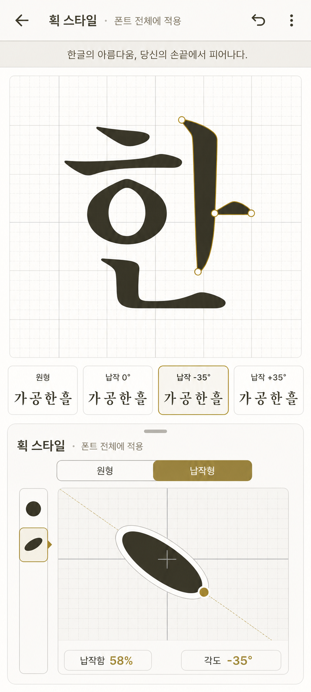

# 도구 물성 기반 획 스타일

결과형 키워드만 고르는 대신, 어떤 도구가 어떤 움직임으로 획을 만드는지 선택하게 한다.

`획 = 도구 형태 × 각도 × 압력 × 방향·속도 × 꺾임·마감`

브러시는 스켈레톤 편집 전에 선택하고, 편집 중에도 언제든 교체한다. 변경 결과는 전체 아웃라인에 즉시 반영한다.

`스켈레톤 + 브러시 + 끝맺음·세리프 + 광학 보정 = 실시간 아웃라인`

- 스켈레톤을 유일한 원본으로 유지
- 개별 아웃라인 직접 편집은 제공하지 않음
- 세리프, 접합부, 끝맺음은 생성 규칙으로 조절
- 최종 출력할 때만 아웃라인 확정
- 화면 미리보기와 OTF·TTF 출력에 같은 생성 원칙 적용

먼저 브러시 프리셋과 전체 반영을 만들고, 이후 도구 물성과 광학 보정 규칙을 확장한다.

## 확정한 1차 범위

- 신규 보정 화면 상단에는 획 스타일 전용 버튼을 두지 않는다. 기존 설정 버튼 하나가 `글로벌 스타일` 하단 조절판을 연다.
- 조절판 안에서 `글자 네모꼴`과 `획 스타일`을 탭으로 전환한다. 기존 상단 네모꼴 팝업도 같은 하단 구조로 통합한다.
- 드로어 상단에는 `글로벌 스타일 · 글자 전체 인상 설정`을 고정 표시한다.
- 현재 보정 문장과 큰 글자를 전체 적용 결과를 확인하는 실시간 미리보기로 사용한다.
- 획 스타일 탭에서는 이전에 선택한 획 강조, 꼭짓점, 베지어 핸들, 레이아웃 강조를 숨겨 글자 윤곽만 보이게 한다. 드로어를 닫으면 기존 선택과 트랙패드 상태가 다시 보인다.
- 붓촉은 `원형`, `납작형`, `네모형` 세 가지로 시작한다.
- 납작형과 네모형은 납작한 정도와 좌·우 기울기 각도를 함께 조절한다.
- 납작형 붓촉은 모서리가 없는 타원형으로 표현한다.
- 네모형 붓촉은 모서리가 살아 있는 직사각형으로 표현하되, 대각선을 기존 획 굵기와 같게 두어 원형보다 더 돌출되지 않게 한다.
- 방향은 예측하기 쉬운 `고정 방향`만 제공한다.
- 변경은 폰트 전체에 적용한다. 개별 획 예외는 만들지 않는다.
- 원형을 고르면 납작한 정도와 각도는 숨긴다.
- 다시 납작형이나 네모형으로 돌아오면 마지막 납작함과 각도를 복원한다.
- 브러시 크기는 별도 옵션으로 두지 않는다. 전체 획 굵기는 기존 굵기 조절이 맡고, 납작한 정도는 붓촉 비율만 바꾼다.
- 붓촉 선택 카드의 `한`, 현재 보정 문장, 큰 편집 글자로 직선·곡선·사선·교차부·받침 밀도를 함께 확인한다.
- 자동 저장과 같은 화면의 Undo/Redo로 변경을 복원한다.

납작함은 슬라이더로 조절하고 값은 조작 중에만 보여준다. 각도는 붓촉의 긴 축과 화면 가로축이 이루는 방향으로 정의하며 `-90°~+90°`, 기본 `0°`로 둔다. 조절 중에는 대표 글자에 즉시 반영하고, 손을 떼는 순간까지의 연속 조작을 히스토리 한 항목으로 저장한다.

흐름은 `글로벌 스타일 버튼 → 획 스타일 탭 → 원형/납작형/네모형 선택 → 납작한 정도와 각도 조절 → 보정 문장과 큰 글자 확인 → 필요하면 Undo/Redo → 조절판 닫기`로 잡는다.

## 후속 검토

- `획 따라가기`는 급커브와 교차부가 불안정할 수 있어 기술 실험 뒤 판단한다.
- 압력, 속도, 끝맺음, 세리프는 시간에 따른 입력과 획 방향의 기준부터 정한 뒤 확장한다.
- 개별 획 오버라이드는 전체 적용만으로 부족하다는 필요가 확인된 뒤 검토한다.
- 압력, 끝맺음, 세리프처럼 조절 항목이 늘어나 드로어가 복잡해질 때만 별도 전체 화면 편집기를 다시 검토한다.

고정각 납작형·네모형은 SVG 기본 stroke 대신 중심선을 세분화하고 고정 붓촉을 각 구간에 sweep하는 공통 윤곽 엔진으로 구현했다. 화면은 이 윤곽을 채우고 OTF는 같은 윤곽을 폰트 좌표로 투영해 합친다. 브라우저 미리보기와 전체 OTF 생성·다운로드까지 검증했으며, 설치 환경별 세부 렌더링 비교는 남아 있다.

기존 와이어프레임은 초기 화면 구조와 정보 우선순위를 확인한 기록으로 남긴다. 현재 구현은 글로벌 스타일 통합 패널, 획 생성, 저장, Undo/Redo, OTF 출력까지 연결됐다.

## 붓촉 모양 적용 예시 시안

시안 뒤 논의에서 네모형을 1차 범위에 추가했다. 실제 선택 이름은 `원형 · 납작형 · 네모형`이며, 납작형과 네모형이 같은 납작함·각도 값을 공유한다.

기존 편집기의 큰 글자 캔버스와 트랙패드 구조를 그대로 사용한다. 글로벌 스타일에서 획 스타일 탭을 고르면 트랙패드가 납작함과 방향을 조절하는 판으로 바뀌며, 붓촉을 직접 돌리는 동작으로 각도를 정한다. 큰 글자에는 선택 오버레이를 숨긴 현재 결과를, 조절판에는 세 붓촉의 대표 글자를 함께 보여준다.

이 시안은 인터랙션 방향을 확인하는 그림이다. 실제 납작 붓촉 윤곽과 각도별 글자 모양은 생성 엔진 기술 실험 결과로 다시 검증한다.

### 검증 결과 — 네모형 붓촉

현재 납작형은 모서리 없는 타원형이라 획 끝과 방향 전환이 부드럽게 이어진다. 사각형 붓촉은 끝단을 수직이나 사선으로 또렷하게 자르고, 같은 스켈레톤에서도 각진 고딕·간판 글씨와 가까운 인상을 만들 수 있다.

붓촉 선택 구조는 사용자의 표현에 맞춰 `원형 · 납작형 · 네모형`으로 확정했다. 내부 생성 모델은 타원과 직사각형으로 구분하며, 두 모양은 `납작함`과 `각도`를 공통으로 사용하고 원형에서는 두 값을 숨긴다.

고정각 직사각형 sweep과 획별 Boolean union으로 직선·사선·곡선·직각 꺾임·교차부를 처리했다. 네모형을 적용한 보정 문장과 큰 글자를 브라우저에서 확인했고, 같은 설정으로 완성형 전체 OTF 생성·다운로드까지 통과했다. 실제 설치 후 여러 렌더러에서 작은 크기의 모서리와 교차부를 비교하는 검증은 후속으로 남긴다.
