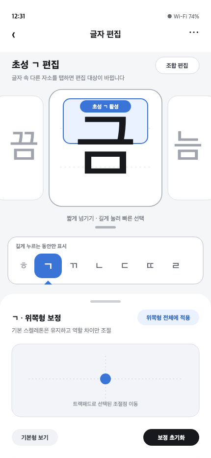

# 모바일 자소 캐러셀 편집

가운데 글자의 자소 하나를 활성화하고 좌우 스와이프로 해당 자소만 교체한다. 양옆에는 이전·다음 조합을 미리 보여준다.

캐러셀과 편집 화면을 위아래로 따로 두지 않는다. 큰 글자 편집 카드 자체가 캐러셀의 중앙 카드다. 이전·다음 카드는 중앙과 같은 크기와 높이를 쓰고 화면 좌우에서 일부만 보인다. 옆 카드를 누르거나 밀면 중앙으로 들어오며, 형태 선택은 중앙 카드에서만 한다.

편집 선택은 `자소 전체 → 획 → 점`으로 점진적으로 좁혀 간다.

나머지 두 자소는 캐러셀 교체만 고정할 뿐 편집을 막지 않는다. 중앙 글자에서 다른 자소를 탭하면 즉시 편집 대상을 바꾼다.

상단 캐러셀의 규칙은 항상 같다. **활성화된 파트의 자소만 바뀌고 나머지 파트는 유지된다.**

- `곰`에서 초성 `ㄱ` 활성: `놈`, `돔`, `롬`처럼 초성만 교체
- `곰`에서 중성 `ㅗ` 활성: `곰`, `굠`, `굼`처럼 중성만 교체
- 종성이 활성화되면 초성과 중성은 유지하고 종성만 교체
- 중앙 글자의 다른 자소를 탭하면 활성 파트와 캐러셀 후보가 함께 바뀜

받침이 없는 글자도 초성·중성·종성을 모두 선택할 수 있다.

- 중앙 활성 카드에서 초성·중성·종성을 직접 탭해 활성화
- 화면에 존재하는 자소는 해당 형태를 탭하고, 없는 종성은 빈 종성 영역의 `+ 받침`을 탭함
- 상단 캐러셀을 길게 누르면 현재 활성 파트의 자소를 빠르게 탐색
- 받침 없는 글자의 종성은 `없음`으로 표시하고, 선택하면 종성 캐러셀 활성화
- 종성 후보에는 항상 `없음`을 포함해 다시 제거할 수 있게 함

종성 추가처럼 레이아웃 분류가 바뀌는 선택은 탐색 중 임시 미리보기로 보여주고, 손을 떼거나 후보를 탭했을 때 확정한다.

- 짧게 넘기면 자소를 한 칸씩 교체
- 길게 누르고 좌우로 밀면 활성 파트의 자소 목록을 빠르게 탐색
- 별도 탭과 상시 자소 목록을 두지 않음
- 세 파트를 함께 확인하되 한 번에 하나만 조작

상단 캐러셀은 글자와 문맥을 선택하는 유일한 탐색기다.

## 빠른 자소 선택 다이얼

중앙 활성 카드의 빈 영역을 약 0.36초 길게 누르면 화면을 딤 처리하고 현재 역할의 자소를 가로 다이얼로 펼친다. 획이나 꼭짓점의 터치 영역에서는 발동하지 않는다.

- 누른 채 좌우로 움직이면 캐러셀과 같은 순서로 후보를 탐색
- 선택된 자소는 가운데에서 크게, 인접 자소는 그보다 작게 표시
- 탐색 중에는 중앙 조합 글자만 임시로 바꾸어 결과를 즉시 확인
- 후보가 한 칸 바뀔 때 지원 기기에서 짧은 진동 제공
- 손을 떼면 선택 확정, 아래쪽 취소 영역으로 내리거나 터치가 취소되면 원래 글자로 복귀
- 길게 누르기 전에 이동 임계치를 넘으면 다이얼을 열지 않고 기존 한 칸 스와이프로 처리

현재는 조작 규칙을 확인하는 프로토타입으로 구현했다. 실제 기기에서 길게 누르는 시간, 한 칸 이동 거리, 딤 강도와 엄지손가락 가림을 검증한 뒤 수치를 확정한다.

자음 기본형 아래의 적용 문맥 카드는 현재 음절을 첫 칸에 반복하지 않고 역할별 위치를 고정한다.

1. `세로모음`: 해당 자음을 초성에 둔 조합
2. `세로모음+받침`: 해당 자음을 종성에 둔 조합
3. `가로모음`: 해당 자음을 초성에 둔 조합
4. `가로모음+받침`: 해당 자음을 종성에 둔 조합

예를 들어 ㄷ은 `다 · 갇 · 도 · 곧`으로 표시한다. 받침 문맥에서 ㄷ을 초성에 둔 다른 글자를 보여주지 않는다. 현재 편집 중인 역할과 모음 방향에 해당하는 카드만 활성 표시하며, 활성 카드를 첫 칸으로 이동시키지 않는다. 초성이나 종성으로 쓸 수 없는 자음 역할은 사용할 수 없는 카드로 표시한다.

하단 드로어는 현재 작업에 따라 내용이 바뀌는 편집 영역이다.

- 기본 상태는 선택된 획이나 조절점을 움직이는 트랙패드
- `획 스타일`을 누르면 폰트 전체에 적용되는 원형·납작형, 납작함, 각도 조절
- 현재 적용 범위를 눌렀을 때만 `기본형 → 역할형 → 현재 레이아웃` 계보와 보정 작업 표시

획 스타일 드로어가 열려 있어도 상단 캐러셀의 규칙은 바뀌지 않는다. 활성화된 파트만 스와이프로 바뀌며, 각 글자에 폰트 전체 획 스타일이 어떻게 보이는지 즉시 확인한다. 드로어를 닫으면 이전 트랙패드 편집 상태로 돌아간다.

계보에서는 상위 단계 편집, 형태 비교, 현재 보정 제거, 영향을 받는 대표 글자 확인만 제공한다. 다른 역할형이나 레이아웃을 다시 선택하지 않는다.

## 와이어프레임

### 캐러셀과 빠른 자소 선택

[SVG 원본](./assets/모바일-자소-캐러셀-v2.svg)

빠른 선택과 트랙패드 배치 참고용이다. 적용 범위 표현은 아래 계보 인스펙터로 대체한다.

현재 와이어프레임은 동작 규칙 확인 후 갱신이 필요하다. `곰 → 금 → 굼`처럼 중성이 바뀌는 예시에서는 중성이 활성 상태로 표시되어야 하며, 초성 활성 표시는 초성만 바뀌는 조합으로 교체해야 한다.

### 현재 형태 계보 인스펙터

![[assets/현재-형태-계보-인스펙터-v5.png]]

`옵시디언 현재-형태-계보-인스펙터-v5.svg`

## 다음 논의

- 기본 스켈레톤 편집 화면의 대표 조합 미리보기
- 빠른 자소 선택의 표준 순서와 형태별 묶음
- 빠른 자소 선택 행을 임시 플로팅 팝업으로 표시할지 여부

## 빠른 탐색 조작 개선

빠른 자소 선택 다이얼은 손을 떼는 순간 현재 후보를 확정하고 팝업도 즉시 닫는다. 한 화면에는 13개 후보를 가로로 보여주며, 중심 근처에서는 한 칸씩 정밀하게 움직이고 멀어질수록 더 빠르게 후보를 넘긴다.

빠른 탐색 목록에는 시작과 끝을 둔다. 첫 후보에서 왼쪽으로 밀거나 마지막 후보에서 오른쪽으로 밀어도 반대편으로 순환하지 않고 끝에 멈춘다. 가장자리의 빈 슬롯은 다른 후보를 반복하지 않아 목록의 경계를 보여준다. 일반 캐러셀의 한 칸 이동과는 별도로 빠른 탐색에만 적용한다.

엄지손가락 가림, 작은 화면의 가독성, 빠른 이동 뒤 정확한 정지 가능성은 실제 기기에서 확인한다.

빠른 탐색이 열린 뒤에는 가로 캐러셀 제스처와 입력 소유권을 분리한다. 손가락이 상하로 움직여도 탐색을 끊지 않고, 세로 위치는 아래 취소 영역 판단에만 사용한다. 같은 포인터를 손을 뗄 때까지 추적하고, 손을 떼거나 시스템 터치 취소가 오면 팝업을 반드시 닫는다.

실제 사용에서 빠른 탐색이 간헐적으로 끊기거나 손을 떼도 닫히지 않는 현상이 남았다. 활성 카드 한 영역에 자소·획·꼭짓점 선택, 캐러셀, 길게 누르기, 취소 판정이 겹쳐 터치 이벤트 경합 가능성이 크다. 빠른 탐색 다이얼은 현재 UI에서 숨기고, 일반 좌우 캐러셀만 유지한다. 입력 영역이나 진입 방식을 분리하는 재설계 전에는 다시 노출하지 않는다.

## 탐색과 상세 편집 진입 역할 교환 가설

현재 상단의 초성·중성·종성 선택은 캐러셀 기준 변경과 트랙패드 열기를 함께 맡고, 하단 자소 버튼은 상세 편집 진입을 맡는다. 이 두 역할을 다음처럼 분리하는 안을 검토한다.

- 중앙 글자의 자소를 누르면 해당 자소의 상세 편집으로 이동
- 하단의 초성·중성·종성 버튼은 캐러셀에서 바꿀 파트만 선택하고 트랙패드는 열지 않음
- 하단 선택기는 이후 셀렉트박스나 빠른 선택 메뉴로 확장해 자소 탐색 진입 시간을 줄임
- 메인 화면 최하단의 `현재 글자의 선택 자소 편집` 버튼을 눌렀을 때만 현재 글자 보정 트랙패드를 엶

이 구조는 `무엇을 둘러볼지`와 `무엇을 정밀하게 고칠지`를 분리해 캐러셀을 가볍게 탐색할 수 있다는 장점이 있다. 글자에서 대상을 직접 누르는 동작도 상세 편집 진입과 자연스럽게 연결된다. 반면 중앙 글자 탭이 자소 선택, 획 선택, 캐러셀 제스처를 모두 받아온 기존 구조와 충돌할 수 있다. 글자 전체 탭이 아니라 글자 안의 초성·중성·종성 영역 탭으로 진입시키고, 스와이프 판정과 탭 판정을 분리하는 편이 안전하다.

트랙패드를 한 단계 늦게 여는 것은 탐색 중 화면이 갑자기 좁아지는 문제를 줄이지만, 자주 편집하는 사용자에게는 탭이 하나 늘어난다. `하단 파트 선택 → 캐러셀 탐색 → 최하단 편집 버튼 → 현재 글자 보정` 흐름의 속도는 실제 기기에서 확인한다. 자소 기본형 상세 편집은 중앙 자소 탭으로 별도 진입한다.

2026-08-18 역할 교환 흐름을 구현했다. 하단 초성·중성·종성 카드는 화면을 이동하거나 트랙패드를 열지 않고 캐러셀 기준만 바꾼다. 중앙 글자의 자소를 누르면 해당 자소 기본형 상세 편집으로 이동한다. 현재 글자 안에서의 위치·비율 보정 트랙패드는 메인 화면 최하단의 `{현재 글자}의 {선택 자소} 편집` 버튼을 눌렀을 때만 열린다. 캐러셀을 스와이프한 직후 자소 탭으로 오인해 상세 편집이 열리지 않도록 드래그 뒤 클릭도 차단했다.

단위 테스트 47개, 모바일 브라우저 자동화 11개, 프로덕션 빌드를 통과했다. 하단 선택기를 셀렉트박스나 빠른 선택 메뉴로 바꾸는 안과, 편집 버튼이 한 단계를 늘리는 체감은 실제 기기 검증 뒤 결정한다.

상세 편집 헤더는 자소의 역할을 먼저 보여주는 `초성 ㄱ 편집`, `중성 ㅗ 편집`, `종성 ㅁ 편집` 형식을 유지한다. 화면 상단에는 레이아웃별 결과 미리보기 카드를 먼저 배치하고 그 아래에서 자소 기본형을 편집한다. `초성 기본형`, `초성 레이아웃 전체에 일괄 적용`, `레이아웃별 적용`, `보기 전용` 같은 설명 문구는 화면 밀도를 낮추기 위해 제거했다. 미리보기 카드는 너비 54px, 내부 글자 44px 수준으로 줄여 편집 캔버스 공간을 더 확보했다.

상세 편집을 끝내고 캐러셀로 돌아갈 때 획·꼭짓점 선택과 진행 중인 미리보기를 모두 정리한다. 캐러셀에는 꼭짓점 핸들이나 이전 선택 강조가 남지 않고, 브레드크럼은 상세 단계 대신 `글자 속 자소를 누르면 상세 편집으로 이동합니다`라는 기본 안내로 돌아간다. 단위 테스트와 모바일 브라우저 자동화에서 복귀 상태를 확인했다.
